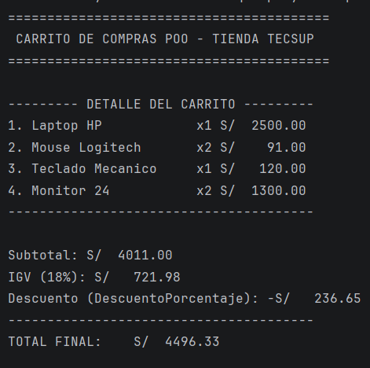

## CARRITO POO CON IA

Estudiante: Oscar Armando Eneque Lluen

## Estructura del Prompt
Segun Gemini para generar un buen proyecto de Programación Orientada a Objetos (POO) mediante IA, el prompt debe ser estructural y detallado. No basta con pedir "haz un carrito de compras"; se debe definir el dominio, las entidades y las reglas de negocio.
Aquí la estructura recomendada:
Estructura Ideal del Prompt
1. Rol y Contexto: Define quién es la IA (ej. Senior Android Developer).
2. Objetivo del Proyecto: Qué problema resuelve el software.
3. Entidades Principales (Clases): Qué objetos existen y qué datos manejan (Atributos).
4. Comportamiento (Métodos): Qué acciones pueden realizar esos objetos.
5. Relaciones: Cómo interactúan (¿Un Carrito tiene una lista de Productos?).
6. Principios de Diseño: Pedir explícitamente el uso de Encapsulamiento, Abstracción, Herencia y Polimorfismo, además de principios SOLID.
7. Stack Tecnológico: Lenguaje (Kotlin) y entorno (Android/JVM).
   

## Captura

## Prompt
Actúa como un Arquitecto de Software experto en Kotlin. Necesito diseñar un sistema de Carrito de Compras siguiendo estrictamente los principios de POO y SOLID.
Requerimientos:
1. Entidades: Crea una clase Producto (con id, nombre, precio y stock) y una clase Carrito.
2. Lógica de Carrito: El Carrito debe permitir agregar productos, eliminar, calcular el total con impuestos y aplicar descuentos.
3. Abstracción: Crea una interfaz o clase abstracta Descuento para que existan diferentes tipos (ej. DescuentoFijo, DescuentoPorcentaje) aplicando polimorfismo.
4. Encapsulamiento: Asegúrate de que las propiedades sensibles sean privadas y se accedan mediante métodos específicos.
5. Salida: Proporciona el código en Kotlin, bien documentado, y una breve explicación de cómo se aplicaron los pilares de la POO en el diseño."

Tips para que el código sea de "Calidad Senior"

• Pedir Inyección de Dependencias: "Usa inversión de dependencias para que el Carrito no dependa de una implementación específica de Descuento".

• Manejo de Errores: "Incluye manejo de excepciones personalizadas para casos como 'Stock Insuficiente'".

• Inmutabilidad: "Prefiere el uso de data classes y colecciones inmutables donde sea posible".
