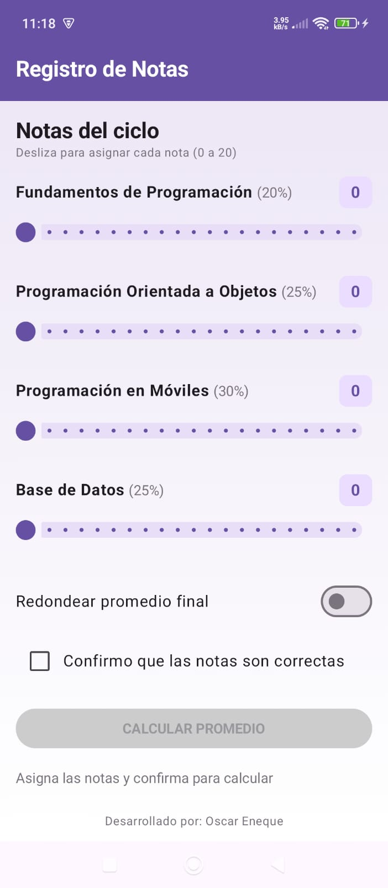
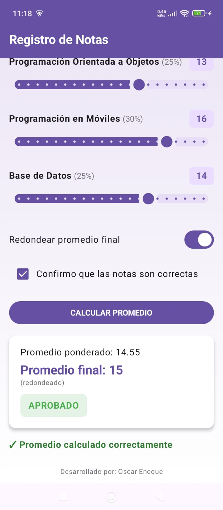

# Registro de Notas - Jetpack Compose

Estudiante: Oscar Eneque

Descripción: App que calcula el promedio ponderado de 4 cursos de programación
a partir de notas con Sliders (0 a 20). Incluye Switch para redondear
el promedio final, Checkbox de confirmación que activa el botón de cálculo,
y una tarjeta de resultados con observación según rango (EXCELENTE, APROBADO,
EN RECUPERACIÓN, DESAPROBADO).

## Capturas

