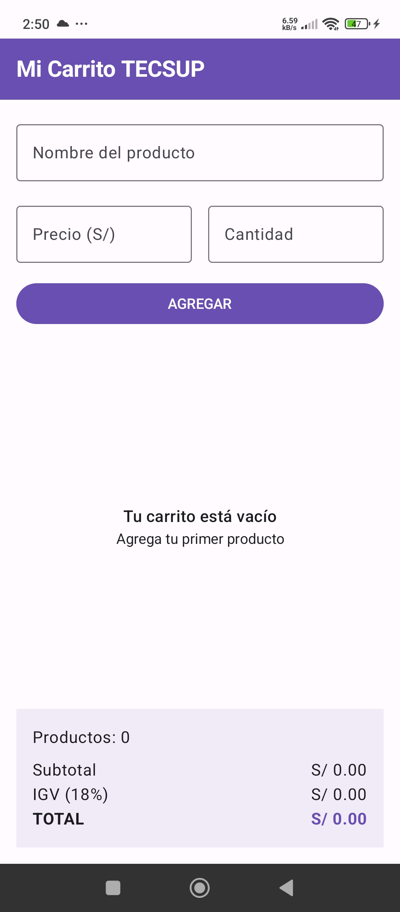
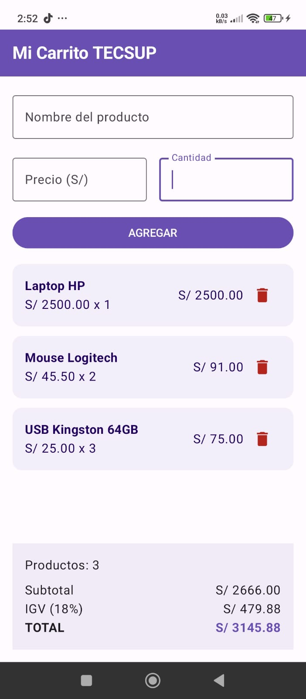

# Laboratorio 04 - Mi Carrito TECSUP

Estudiante: Oscar Armando Eneque Lluen

Descripción: 
Aplicación móvil desarrollada en Kotlin con Jetpack Compose que permite agregar productos a un carrito de compras, mostrar una lista dinámica, eliminar productos y calcular el subtotal, IGV y total automáticamente.

## Funcionalidades
- Registrar nombre, precio y cantidad de un producto.
- Agregar productos al carrito.
- Mostrar los productos mediante LazyColumn.
- Eliminar productos del carrito.
- Calcular subtotal, IGV del 18% y total.
- Mostrar un mensaje cuando el carrito está vacío.

## Capturas

### Carrito vacío

### Carrito con productos

### 1. ¿Por qué usamos mutableStateListOf y no una MutableList normal?
Porque mutableStateListOf permite que Jetpack Compose detecte los cambios de la lista. Cuando agregamos o eliminamos un producto, la pantalla se actualiza automáticamente. Con una MutableList normal, Compose no detectaría esos cambios de la misma manera.

### 2. ¿Por qué la lista productos se declara con val si podemos agregar y eliminar elementos?
Porque val significa que la variable siempre apunta a la misma lista. Lo que no cambia es la referencia, pero sí podemos modificar el contenido de la lista agregando o eliminando productos.

### 3. ¿Qué hace weight(1f) en la LazyColumn?
Hace que la LazyColumn ocupe el espacio disponible entre el formulario y el panel de totales. Gracias a eso, la lista puede crecer y desplazarse mientras el panel de totales se mantiene fijo en la parte inferior.