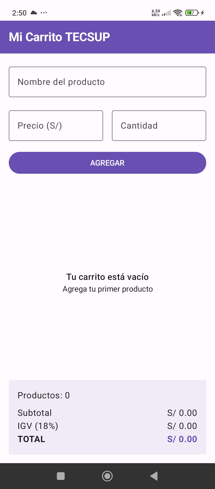
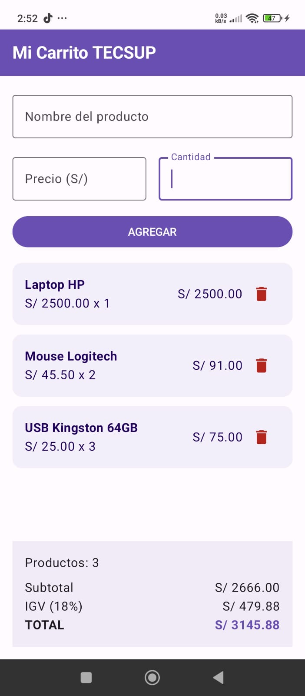

# Laboratorio 04 - Mi Carrito TECSUP

Estudiante: Oscar Armando Eneque Lluen

Descripción: 
Aplicación móvil desarrollada en Kotlin con Jetpack Compose que permite agregar productos a un carrito de compras, mostrar una lista dinámica, eliminar productos y calcular el subtotal, IGV y total automáticamente.

## Funcionalidades
- Registrar nombre, precio y cantidad de un producto.
- Agregar productos al carrito.
- Mostrar los productos mediante LazyColumn.
- Eliminar productos del carrito.
- Calcular subtotal, IGV del 18% y total.
- Mostrar un mensaje cuando el carrito está vacío.

## Capturas

### Carrito vacío

### Carrito con productos

### 1. ¿Por qué usamos mutableStateListOf y no una MutableList normal?
Porque mutableStateListOf permite que Jetpack Compose detecte los cambios de la lista. Cuando agregamos o eliminamos un producto, la pantalla se actualiza automáticamente. Con una MutableList normal, Compose no detectaría esos cambios de la misma manera.

### 2. ¿Por qué la lista productos se declara con val si podemos agregar y eliminar elementos?
Porque val significa que la variable siempre apunta a la misma lista. Lo que no cambia es la referencia, pero sí podemos modificar el contenido de la lista agregando o eliminando productos.

### 3. ¿Qué hace weight(1f) en la LazyColumn?
Hace que la LazyColumn ocupe el espacio disponible entre el formulario y el panel de totales. Gracias a eso, la lista puede crecer y desplazarse mientras el panel de totales se mantiene fijo en la parte inferior.

Prueba de commit desde Mac del laboratorio

## VI. Preguntas de reflexión

### 1. ¿Por qué el DropdownMenu se declara dentro de un Box junto al ícono que lo activa, y no en cualquier parte de la pantalla?

Porque el DropdownMenu debe aparecer relacionado con el botón de tres puntos que lo abre. Al colocarlo junto al ícono, el menú se muestra en la posición correcta respecto al producto seleccionado.

### 2. ¿Qué diferencia de alcance hay entre las opciones del DropdownMenu y las del NavigationDrawer?

Las opciones del DropdownMenu afectan a un producto específico, por ejemplo marcarlo como favorito, compartirlo o reportarlo.

En cambio, las opciones del NavigationDrawer afectan a toda la aplicación, porque permiten cambiar entre secciones como Inicio, Mis pedidos, Favoritos y Perfil.

### 3. ¿Cómo estructuraste el código para que el contador de favoritos del Drawer se entere de lo que pasa en el DropdownMenu?

El estado de favoritos se colocó en AppNavegacion.kt usando una lista reactiva con mutableStateListOf.

TarjetaProducto envía la acción mediante un callback cuando se selecciona Favoritos. AppNavegacion recibe el producto, lo agrega a la lista si no está repetido y luego envía favoritos.size a AppDrawer.

De esta forma, el Drawer puede actualizar automáticamente el badge con la cantidad de favoritos.

### 4. ¿Qué tuviste que corregir del código que generó la IA para la mejora del badge de favoritos?

La mejora del badge funcionó correctamente, pero se detectó que los productos agregados en Inicio desaparecían al cambiar de sección.

Para corregirlo, se movió también la lista de productos a AppNavegacion.kt, de manera que el estado se mantenga mientras se navega entre Inicio, Favoritos, Mis pedidos y Perfil.

## VII. Observaciones

1. Al separar el código en TarjetaProducto.kt, AppDrawer.kt y AppNavegacion.kt, el proyecto quedó más ordenado y fue más fácil identificar la función de cada parte.

2. Durante las pruebas se observó que el estado de los productos se perdía al cambiar de sección, por lo que fue necesario mover la lista a un nivel superior para conservarla.

## Conclusiones

1. Aprendí que el DropdownMenu sirve para acciones relacionadas con un elemento específico, mientras que el NavigationDrawer permite navegar entre secciones generales de la aplicación.

2. La fase con IA ayudó a reorganizar el proyecto y agregar el contador de favoritos, pero fue necesario revisar y probar el código generado para detectar problemas de estado y corregirlos.
